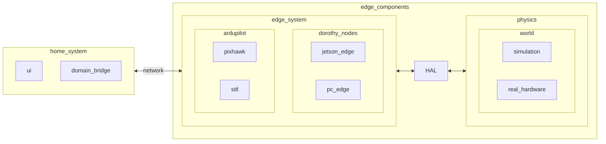

# scenario run framework

## containers running

to see all available docker images check out [containers setup](../1-run/dockers_setup.md).

for a full running scenario you need the following containers involved -

1. simulation / hardware interface container: to act as the robot sensors and environment. simulation runs on a pc and hardware interface runs on the jetson.

2. dorothy edge nodes container: running the mission computer logic. can be run both on the pc or on the jetson.

3. user interface container: running operator applications at the home station pc.

## configuration and setup

[`setup_host_env.sh`](../1-run/setup_host_env.md) detects your os and according to it adds the relevant scripts path to `PATH` variable.

`system_setup.json` serves as a system configuration file to launch all the above dockers in your desired way:

``` json

--8<-- "system_scripts/system_setup.json"
```

the following configuration can be changed:

`machine`: "pc" or "jetson"  

`jetson_machine_ip`: relevant only if the machine is jetson

`ardupilot`: "pixhawk" or "sitl"  

`DOMAIN_IDS`: domain ids for home and edge systems.

## run flow



Explanation : 

1. home system - your ui applications which runs on a pc.  

2. communicating only with your edge_system software components e.g. jetson and pixhawk, and can experience some kind of connection interferings. 

3. the edge_system conatains the mission computer and the low level control of the robot. the edge_system should be easily swapped between hardware in the loop mode and software in the loop mode.

4. the physics can be changed to be the real robot hardware and sensors or your simulated robot (digital twin).

5. for the easiness of this swap between the real robot and the simulation there is a need to develop a good enough HAL (Hardware Abstraction Layer) to create the same piping between the real robot and the simulation.

## run scheme

| characteristic  |                                           home                                           |                                simulation                                 |                                     edge                                     | notes                                                                                                                                                                                                                                      |
|---------------- |:---------------------------------------------------------------------------------------: |:------------------------------------------------------------------------: |:---------------------------------------------------------------------------: |------------------------------------------------------------------------------------------------------------------------------------------------------------------------------------------------------------------------------------------- |
| DOMAIN_ID       |                                            11                                            |                                    12                                     |                                      12                                      | seperate domain ids to not interfere                                                                                                                                                                                                       |
| running flow    | tmux ...<br>1. docker run rviz<br>2. docker run teleop node<br>3. docker run more_ui..   | tmux ...<br>1. docker run simulation nodes <br>2. docker run edge nodes   | ssh ... <br>tmux ...<br>1. init edge components<br>2. docker run edge nodes  | edge nodes should be the same for the simulation and the edge. <br>differences between them should be described clearly in config files.<br>switching between them should be obtained by changing one environment/command line variable.   |
|                 |                                                                                          |                                                                           |                                                                              |                                                                                                                                                                                                                                            |
